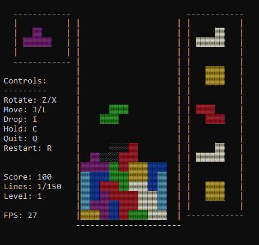
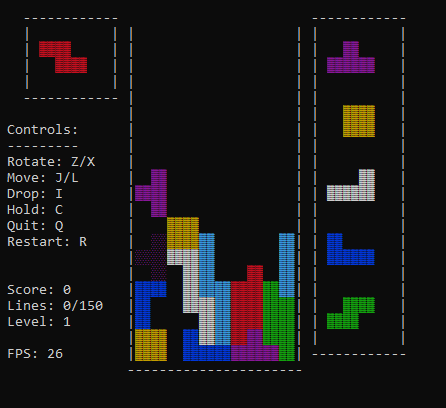

# ascii-tetris

In order to create a OCaml environment to run the game, one can follow the instructions at https://www.cs.cornell.edu/courses/cs3110/2019fa/install.html followed by the instructions in INSTALL.txt.

Ascii tetris is an implementation of the classic game Tetris in the functional programming language OCaml. The game is designed to be played in the terminal using just ascii characters as opposed to a seperate GUI. 

**Features**
- Fully fledged movement system using the Super-Rotation System
- 5 piece look-ahead queue
- Hold piece functionality
- Ghost piece final position tracing
- 150 line clear rush mode with 10 levels of accelerating gravity
- Line clear animation 

